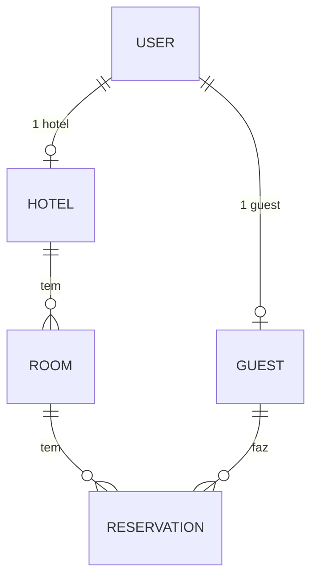

# Entidades e Propriedades do `hotel-api`

### **User** (`user`)
| Propriedade | Tipo | Regras |
|---|---|---|
| `email` | String | obrigatório, único, trim |
| `password` | String | obrigatório, min 4 chars, hash bcrypt, `select: false` |
| `name` | String | obrigatório, trim |
| `role` | String (enum) | obrigatório — `guest` \| `hotel` |
| `createdAt` | Date | auto-preenchido na criação |

Método: `comparePassword(candidate)` (bcrypt compare).

---

### **Hotel** (`hotel`)
| Propriedade | Tipo | Regras |
|---|---|---|
| `user` | ObjectId → `user` | obrigatório, único (1 hotel por user) |
| `name` | String | obrigatório, 3–40 chars, trim |
| `address` | String | trim |
| `city` | String | trim |
| `country` | String | trim |
| `phone` | String | trim |
| `createdAt` | Date | auto |
| `modifiedAt` | Date | auto (em update) |

Populate automático: `user` (`name email role`).

---

### **Guest** (`guest`)
| Propriedade | Tipo | Regras |
|---|---|---|
| `user` | ObjectId → `user` | obrigatório, único (1 guest por user) |
| `name` | String | obrigatório, 3–40 chars, trim |
| `phone` | String | trim |
| `dateOfBirth` | Date | — |
| `createdAt` | Date | auto |
| `modifiedAt` | Date | auto (em update) |

Populate automático: `user` (`name email role`).

---

### **Room** (`room`)
| Propriedade | Tipo | Regras |
|---|---|---|
| `hotel` | ObjectId → `hotel` | obrigatório |
| `name` | String | obrigatório, trim |
| `type` | String (enum) | `single` \| `double` \| `suite`, default `double` |
| `pricePerNight` | Number | obrigatório, min 0 |
| `active` | Boolean | default `true` |
| `createdAt` | Date | auto |
| `modifiedAt` | Date | auto (em update) |

Populate automático: `hotel` (`name city country`).

---

### **Reservation** (`reservation`)
| Propriedade | Tipo | Regras |
|---|---|---|
| `room` | ObjectId → `room` | obrigatório |
| `guest` | ObjectId → `guest` | obrigatório |
| `checkIn` | Date | obrigatório |
| `checkOut` | Date | obrigatório, tem que ser > `checkIn` (validação custom) |
| `status` | String (enum) | `pending` \| `confirmed` \| `cancelled`, default `confirmed` |
| `createdAt` | Date | auto |
| `modifiedAt` | Date | auto (em update) |

Populate automático: `room` (`name type pricePerNight hotel`), `guest` (`name`).

---

### Relacionamentos (diagrama)

Todos os modelos usam `-__v` no select e têm hooks `pre('save')`/`pre('findOneAndUpdate')` para gerir `createdAt`/`modifiedAt` automaticamente.
